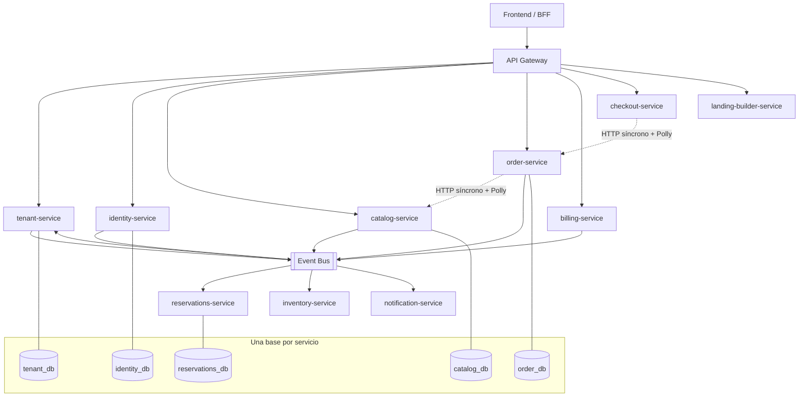
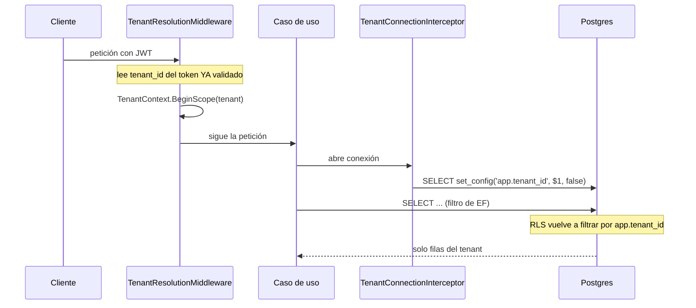
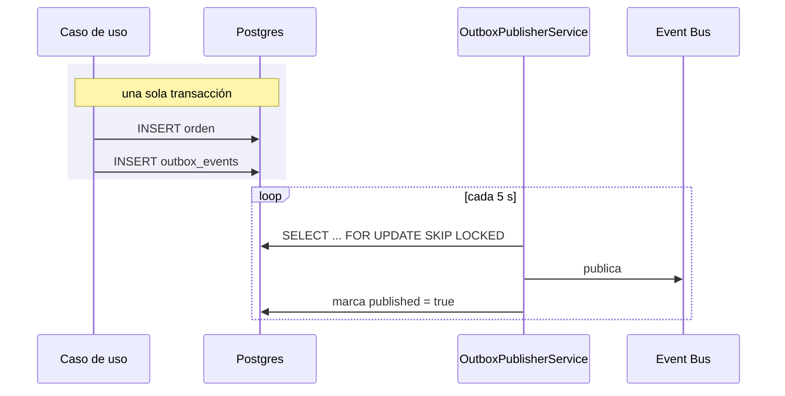

# Arquitectura

Diagrama en Mermaid y dentro del repo, no un PDF que nadie vuelve a abrir
(ExplicacionTec.md, apartado 8.8).

## Las tres capas de aislamiento entre tenants

No es una sola medida, son tres, y cada una tapa lo que dejan pasar las otras.
Esto importa porque **una sola falla**: los filtros de EF Core se saltan con
`IgnoreQueryFilters()` o con SQL crudo, y RLS no sirve de nada si la aplicación
se conecta como dueña de las tablas.

| Capa | Dónde vive | Qué cubre | Qué NO cubre |
|---|---|---|---|
| Filtro global de EF Core | `ModelBuilderExtensions.ApplyTenantFilters` | Toda consulta LINQ | `IgnoreQueryFilters()`, `FromSqlRaw`, SQL a mano |
| Interceptor de escritura | `TenantAssignmentInterceptor` | Que no se escriba en otro tenant | Lecturas |
| Row-Level Security | Políticas en Postgres | Todo, incluido SQL crudo | Nada, si la app se conecta como dueña de la tabla |

El tenant entra al sistema **una sola vez**, en el borde, y de ahí en adelante
viaja solo en el contexto de ejecución. Nunca es un parámetro que alguien tenga
que acordarse de pasar: el día que se olvide, la consulta devolvería datos de
otro cliente.

## Outbox: por qué existe

Un caso de uso tiene que hacer dos cosas —guardar el cambio y avisar al resto
del sistema— y no hay forma de hacerlas atómicamente contra dos sistemas
distintos.

Si el proceso muere entre publicar y marcar, el evento se reenvía: la entrega
es **al menos una vez** y los consumidores tienen que ser idempotentes. La
alternativa —marcar antes de publicar— sería «como mucho una vez», es decir,
perder eventos, que es bastante peor.

El `SKIP LOCKED` es lo que permite que varias instancias del servicio publiquen
a la vez sin pisarse: cada una se lleva las filas que bloquea y las demás pasan
de largo en vez de esperar su turno.

## Por qué hay un SharedKernel

La checklist del documento de prompts pide comparar los `Program.cs` de varios
servicios y desconfiar si divergen. Un paquete compartido convierte esa revisión
manual en algo que no puede fallar: no divergen porque es literalmente el mismo
código.

Lo que vive ahí es infraestructura transversal —tenancy, outbox, auditoría,
formato de error, arranque—, nunca lógica de negocio. Un shared kernel que
empieza a saber de órdenes o de reservas es el primer paso para volver a tener
un monolito, solo que repartido en diez procesos.
